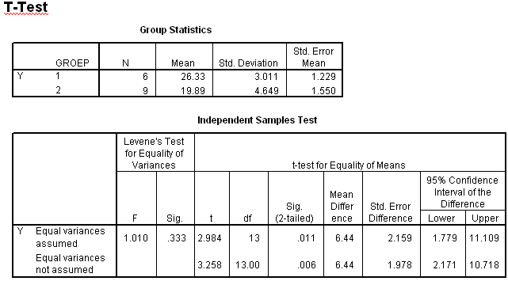

```{r, echo = FALSE, results = "hide"}
include_supplement("uva-independent-samples-means-322-nl-graph01.png", recursive = TRUE)
```

Question
========

Below are two statements. Which of these are correct? I: H~0~: μ~1~ - μ~2~ = 5 must be rejected (at α = 5% two-sided)Ê. II: H~0~: μ~1~ - μ~2~ = -2 must be rejected (at α = 5% bilateral)



Answerlist
----------

* Both pronunciations are correct.
* Utterance I is correct, utterance II is incorrect.
* Utterance I is incorrect, utterance II is correct.
* Both pronunciation are incorrect.

Solution
========

Answerlist
----------

* Both pronunciation are correct: Incorrect
* Pronunciation I is correct, pronunciation II is incorrect: Incorrect
* Pronunciation I is incorrect, pronunciation II is correct: Correct
* Both pronunciation are incorrect: Incorrect

Meta-information
================
exname: uva-independent-samples-means-322-en
extype: schoice
exsolution: 0010
exsection: Inferential Statistics/Parametric Techniques/t-test/Independent samples means
exextra[ID]: 18565
exextra[Type]: Conceptual
exextra[Language]: English
exextra[Level]: Statistical Literacy
exextra[IRT-Difficulty]: 4.315
exextra[p-value]: 0.067
