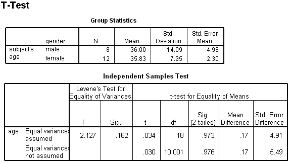

```{r, echo = FALSE, results = "hide"}
include_supplement("uva-independent-samples-means-493-nl-graph01.png", recursive = TRUE)
```

Question
========

Below is SPSS output from a pooled T-test. In a pooled T-test it is assumed that the variances in both populations are equal are. The best estimate for this population variance here is equal to



Answerlist
----------

* 106.87
* 115.83
* 117.33
* 130.87

Solution
========

Answerlist
----------

* 106.87: Incorrect
* 115.83: Correct
* 117.33: Incorrect
* 130.87: Incorrect

Meta-information
================
exname: uva-independent-samples-means-493-en
extype: schoice
exsolution: 0100
exsection: Inferential Statistics/Parametric Techniques/t-test/Independent samples means
exextra[ID]: 6ed6d
exextra[Type]: Interpreting output, Calculation
exextra[Language]: English
exextra[Level]: Statistical Literacy
exextra[IRT-Difficulty]: 4.347
exextra[p-value]: 0.0629
