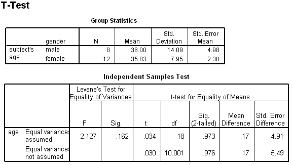

```{r, echo = FALSE, results = "hide"}
include_supplement("uva-independent-samples-means-494-nl-graph01.png", recursive = TRUE)
```

Question
========

Below is SPSS output from a pooled T-test. The conclusion regarding the null hypothesis of equal population averages should here read (at α = 5%, two-sided):



Answerlist
----------

* A significant result, H0 is rejected
* One significant result, H0 is not rejected
* No significant result, H0 is rejected
* No significant result, H0 is not rejected

Solution
========

Answerlist
----------

* A significant result, H0 is rejected: Incorrect
* A significant result, H0 is not rejected: Incorrect
* No significant result, H0 is rejected: Incorrect
* No significant result, H0 is not rejected: Correct

Meta-information
================
exname: uva-independent-samples-means-494-en
extype: schoice
exsolution: 0001
exsection: Inferential Statistics/Parametric Techniques/t-test/Independent samples means
exextra[ID]: 74a9c
exextra[Type]: Conceptual, Interpreting output
exextra[Language]: English
exextra[Level]: Statistical Literacy
exextra[IRT-Difficulty]: 3.974
exextra[p-value]: 0.13
