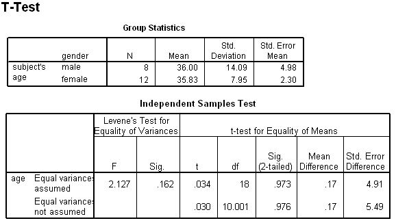

```{r, echo = FALSE, results = "hide"}
include_supplement("uva-independent-samples-means-494-nl-graph01.png", recursive = TRUE)
```

Question
========

Hieronder staat SPSS-uitvoer van een gepoolde T-toets. De conclusie
omtrent de nulhypothese van gelijke populatiegemiddelden moet hier
luiden (bij α = 5%, tweezijdig):



Answerlist
----------

* een significant resultaat, H0 wordt verworpen
* een significant resultaat, H0 wordt niet verworpen
* geen significant resultaat, H0 wordt verworpen
* geen significant resultaat, H0 wordt niet verworpen

Solution
========

Het correcte antwoord is: 

* geen significant resultaat, H0 wordt niet verworpen

Meta-information
================
exname: uva-independent-samples-means-494-nl
extype: schoice
exsolution: 0001
exsection: Inferential Statistics/Parametric Techniques/t-test/Independent samples means
exextra[Type]: Conceptual, Interpreting output
exextra[Language]: Dutch
exextra[Level]: Statistical Literacy
exextra[IRT-Difficulty]: 3.974
exextra[p-value]: 0.13
