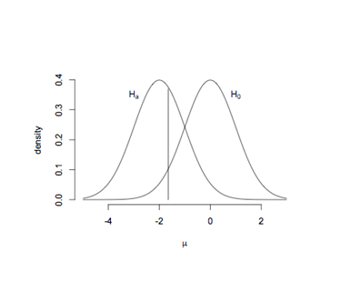

```{r, echo = FALSE, results = "hide"}
include_supplement("uva-inferential-statistics-43-nl-graph01.png", recursive = TRUE)
```

Question
========

A mean is tested. The null hypothesis is that the mean is 0 and the alternative hypothesis that the mean is smaller than 0. In the figure, the null hypothesis and a specific alternative hypothesis drawn along with a limit at 0.05. The probabilities to the right of the vertical line under the null hypothesis and to the left of the vertical line under the alternative hypothesis are, respectively the



Answerlist
----------

* Type I error and Type II error.
* Type II error and power.
* Type I error and power.

Solution
========

Answerlist
----------

* Type I error and Type II error...: Correct
* Type II error and power...: Incorrect
* Type I error and power...: Incorrect

Meta-information
================
exname: uva-inferential-statistics-43-en
extype: schoice
exsolution: 100
exsection: Inferential Statistics
exextra[ID]: 0ca9d
exextra[Type]: Conceptual
exextra[Language]: English
exextra[Level]: Statistical Literacy
exextra[IRT-Difficulty]: 2.033
exextra[p-value]: 0.5668
