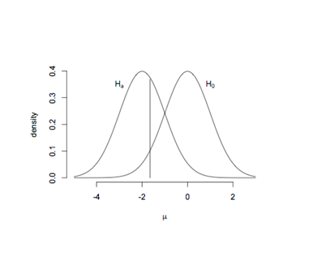

```{r, echo = FALSE, results = "hide"}
include_supplement("uva-inferential-statistics-43-nl-graph01.png", recursive = TRUE)
```

Question
========

Er wordt getoetst op een gemiddelde. De nulhypothese is dat het
gemiddelde 0 is en de alternatieve hypothese dat het gemiddelde kleiner
dan 0 is. In de figuur zijn de nulhypothese en een specifieke
alternatieve hypothese getekend samen met een grenswaarde bij 0.05. De
kansen rechts van de verticale lijn onder de nulhypothese en links van
de verticale lijn onder de alternatieve hypothese zijn respectievelijk
de



Answerlist
----------

Type I fout en Type II fout.
Type II fout en power.
Type I fout en power.

Solution
========

Answerlist
----------

Type I fout en Type II fout.: Correct
Type II fout en power.: Incorrect
Type I fout en power.: Incorrect

Meta-information
================
exname: uva-inferential-statistics-43-nl
extype: schoice
exsolution: 100
exsection: Inferential Statistics
exextra[Type]: Conceptual
exextra[Language]: Dutch
exextra[Level]: Statistical Literacy
exextra[IRT-Difficulty]: 2.033
exextra[p-value]: 0.5668
