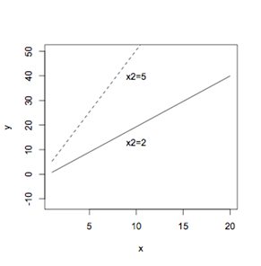

```{r, echo = FALSE, results = "hide"}
include_supplement("uva-intercept-124-nl-graph01.png", recursive = TRUE)
```

Question
========

A regression is done with two independent variables *x*~1~ and *x*~2~ which together should explain the dependent variable *y*. To represent the regression in a figure, for some values of *x*~2~ the regression with only x1 is recalculated over and over again and put into the figure. In this figure there are two such separate regression lines with the values for *x*~2~ of 2 and 5: What assumption of multiple regression for testing for coefficients is here probably being violated here?



Answerlist
----------

* There is a linear relationship between y and each of the independent variables.
* The coefficient of direction is the same for all combinations of other independent variables.
* The population standard deviation is the same for all combinations of independent variables.

Solution
========

Answerlist
----------

* There is a linear relationship between y and each of the independent variables...: Incorrect
* The directional coefficient is the same for all combinations of other independent variables...: Correct
* The population standard deviation is the same for all combinations of independent variables...: Incorrect

Meta-information
================
exname: uva-intercept-124-en
extype: schoice
exsolution: 010
exsection: Inferential Statistics/Regression/Intercept
exextra[ID]: 431d0
exextra[Type]: Conceptual
exextra[Language]: English
exextra[Level]: Statistical Literacy
exextra[IRT-Difficulty]: 3.145
exextra[p-value]: 0.2584
