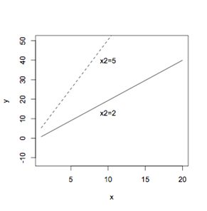

```{r, echo = FALSE, results = "hide"}
include_supplement("uva-intercept-124-nl-graph01.png", recursive = TRUE)
```

Question
========

Er wordt een regressie gedaan met twee onafhankelijke variabelen *x*~1~
en *x*~2~ die samen de afhankelijke variabele *y* moeten verklaren. Om
de regressie weer te geven in een figuur, wordt voor een aantal waarden
van *x*~2~ de regressie met alleen x1 steeds opnieuw uitgerekend en in
de figuur gezet. In deze figuur staan twee van die aparte
regressielijnen met de waarden voor *x*~2~ van 2 en 5: Welke assumptie
van multipele regressie voor het toetsen op coëfficiënten wordt hier
waarschijnlijk geschonden?



Answerlist
----------

Er is een lineaire relatie tussen y en ieder van de onafhankelijke variabelen.
De richtingscoëfficiënt is hetzelfde voor alle combinaties van andere onafhankelijke variabelen.
De populatie standaarddeviatie is hetzelfde voor alle combinaties van onafhankelijke variabelen.

Solution
========

Answerlist
----------

Er is een lineaire relatie tussen y en ieder van de onafhankelijke variabelen.: Incorrect
De richtingscoëfficiënt is hetzelfde voor alle combinaties van andere onafhankelijke variabelen.: Correct
De populatie standaarddeviatie is hetzelfde voor alle combinaties van onafhankelijke variabelen.: Incorrect

Meta-information
================
exname: uva-intercept-124-nl
extype: schoice
exsolution: 010
exsection: Inferential Statistics/Regression/Intercept
exextra[Type]: Conceptual
exextra[Language]: Dutch
exextra[Level]: Statistical Literacy
exextra[IRT-Difficulty]: 3.145
exextra[p-value]: 0.2584
