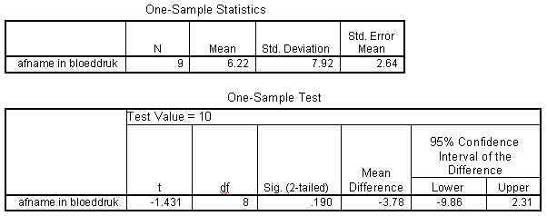

```{r, echo = FALSE, results = "hide"}
include_supplement("uva-one-sample-mean-350-nl-graph01.png", recursive = TRUE)
```

Question
========

Hieronder staat SPSS-uitvoer van een steekproef T toets betreffende
afname in bloeddruk na medicatie. In de uitvoer wordt de hypothese
getoetst dat de gemiddelde afname in de populatie, μ, gelijk is aan 10.
Bij een tweezijdig risico van 5% moet de conclusie luiden



Answerlist
----------

* T-waarde valt in het kritieke gebied, verwerp H0.
* T-waarde valt in het kritieke gebied, verwerp H0 niet.
* T-waarde valt niet in het kritieke gebied, verwerp H0.
* T-waarde valt niet in het kritieke gebied, verwerp H0 niet.

Solution
========

Answerlist
----------

* T-waarde valt in het kritieke gebied, verwerp H0.: Incorrect
* T-waarde valt in het kritieke gebied, verwerp H0 niet.: Incorrect
* T-waarde valt niet in het kritieke gebied, verwerp H0.: Incorrect
* T-waarde valt niet in het kritieke gebied, verwerp H0 niet.: Correct

Meta-information
================
exname: uva-one-sample-mean-350-nl
extype: schoice
exsolution: 0001
exsection: Inferential Statistics/Parametric Techniques/t-test/One sample mean
exextra[ID]: 5c7b2
exextra[Type]: Interpreting output
exextra[Language]: Dutch
exextra[Level]: Statistical Literacy
exextra[IRT-Difficulty]: 3.87
exextra[p-value]: 0.1454
