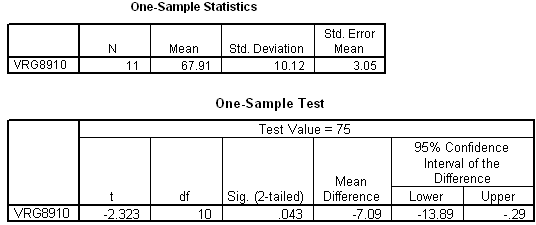

```{r, echo = FALSE, results = "hide"}
include_supplement("uva-one-sample-mean-389-nl-graph01.png", recursive = TRUE)
```

Question
========

Below is output from a one-sample T-test. We want to test H~0~:μ
= 75 tests with α = 5% two-sided. The conclusion of the test should read



Answerlist
----------

* The result is significant, reject H0
* The result is not significant, reject H0
* The result is significant, do not reject H0
* The result is not significant, do not reject H0

Solution
========

Answerlist
----------

* The result is significant, reject H0: Correct
* The result is not significant, reject H0: Incorrect
* The result is significant, reject H0: Incorrect
* The result is not significant, do not reject H0: Incorrect

Meta-information
================
exname: uva-one-sample-mean-389-en
extype: schoice
exsolution: 1000
exsection: Inferential Statistics/Parametric Techniques/t-test/One sample mean
exextra[ID]: dd1fc
exextra[Type]: Conceptual
exextra[Language]: English
exextra[Level]: Statistical Literacy
exextra[IRT-Difficulty]: 3.216
exextra[p-value]: 0.2522
