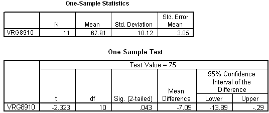

```{r, echo = FALSE, results = "hide"}
include_supplement("uva-one-sample-mean-389-nl-graph01.png", recursive = TRUE)
```

Question
========

Hieronder staat uitvoer van een één-steekproef T-toets. We willen H~0~:μ
= 75 toetsen met α = 5% tweezijdig. De conclusie van de toets moet
luiden



Answerlist
----------

* Het resultaat is significant, verwerp H0
* Het resultaat is niet significant, verwerp H0
* Het resultaat is significant, verwerp H0 niet
* Het resultaat is niet significant, verwerp H0 niet

Solution
========

Het correcte antwoord is: 

* Het resultaat is significant, verwerp H0

Meta-information
================
exname: uva-one-sample-mean-389-nl
extype: schoice
exsolution: 1000
exsection: Inferential Statistics/Parametric Techniques/t-test/One sample mean
exextra[Type]: Conceptual
exextra[Language]: Dutch
exextra[Level]: Statistical Literacy
exextra[IRT-Difficulty]: 3.216
exextra[p-value]: 0.2522
