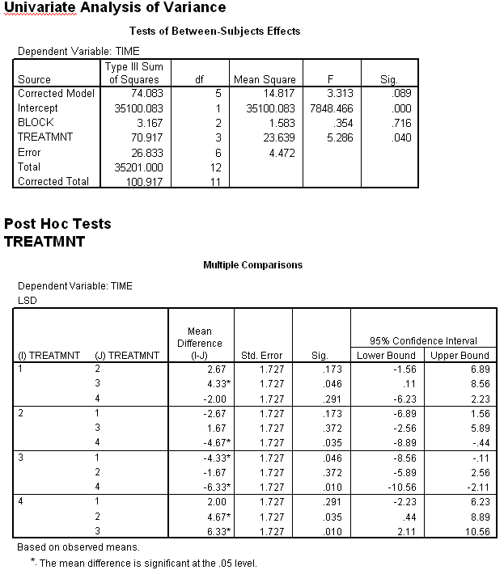

```{r, echo = FALSE, results = "hide"}
include_supplement("uva-oneway-anova-317-nl-graph01.png", recursive = TRUE)
```

Question
========

Below is SPSS output of a Randomized Complete Block ANOVA with TIME as the dependent variable, TREATMNT as the treatment variable and BLOCK as the block variable. When testing whether there is a treatment effect (with a two-sided risk of 5%), the reasoning plus conclusion should read:



Answerlist
----------

* A significant effect because the sample means are unequal.
* No significant effect because the p-value is greater than 0.05.
* A significant effect because the p-value is less than 0.05.
* This cannot be tested because it was not randomized across blocks, but within them.

Solution
========

Answerlist
----------

* A significant effect because the sample averages are unequal: Incorrect
* Not a significant effect because the p-value is greater than 0.05...: Incorrect
* A significant effect because the p-value is less than 0.05...: Correct
* This cannot be tested because it was not randomized across blocks, but within them...: Incorrect

Meta-information
================
exname: uva-oneway-anova-317-en
extype: schoice
exsolution: 0010
exsection: Inferential Statistics/Parametric Techniques/ANOVA/Oneway ANOVA
exextra[Type]: Interpreting output
exextra[Language]: English
exextra[Level]: Statistical Literacy
exextra[IRT-Difficulty]: 3.619
exextra[p-value]: 0.1821
