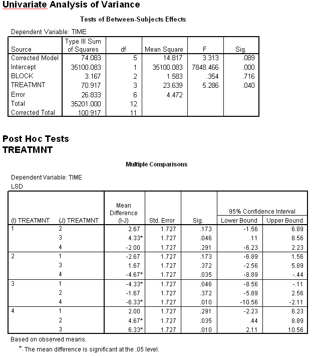

```{r, echo = FALSE, results = "hide"}
include_supplement("uva-oneway-anova-317-nl-graph01.png", recursive = TRUE)
```

Question
========

Hieronder staat SPSS-uitvoer van een Randomised Complete Block ANOVA met
TIME als afhankelijke variabele, TREATMNT als behandelvariabele en BLOCK
als blokvariabele. Bij het toetsen of er een behandeleffect is (met een
tweezijdig risico van 5%) moet de redenering plus conclusie luiden:



Answerlist
----------

* Een significant effect want de steekproefgemiddelden zijn ongelijk.
* Geen significant effect want de p-waarde is groter dan 0.05.
* Een significant effect want de p-waarde is kleiner dan 0.05.
* Dit kan niet getoetst worden, omdat er niet gerandomiseerd is over de blokken, maar erbinnen.

Solution
========

Answerlist
----------

* Een significant effect want de steekproefgemiddelden zijn ongelijk.: Incorrect
* Geen significant effect want de p-waarde is groter dan 0.05.: Incorrect
* Een significant effect want de p-waarde is kleiner dan 0.05.: Correct
* Dit kan niet getoetst worden, omdat er niet gerandomiseerd is over de blokken, maar erbinnen.: Incorrect

Meta-information
================
exname: uva-oneway-anova-317-nl
extype: schoice
exsolution: 0010
exsection: Inferential Statistics/Parametric Techniques/ANOVA/Oneway ANOVA
exextra[Type]: Interpreting output
exextra[Language]: Dutch
exextra[Level]: Statistical Literacy
exextra[IRT-Difficulty]: 3.619
exextra[p-value]: 0.1821
