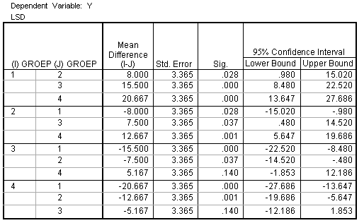

```{r, echo = FALSE, results = "hide"}
include_supplement("uva-oneway-anova-360-nl-graph01.png", recursive = TRUE)
```

Question
========

A CRD-ANOVA that tested whether the population averages of 4 groups were equal were found to be significant. Below is SPSS output of Fisher's LSD multiple comparisons post hoc tests that were conducted to determine which groups differ from each other. Which groups are significantly different from each other at the 5% level?



Answerlist
----------

* 2-4
* 1-2, 1-3, 1-4, 2-3 and 2-4
* 1-3, 1-4 and 2-4
* All

Solution
========

Answerlist
----------

* 2-4: Incorrect
* 1-2, 1-3, 1-4, 2-3 and 2-4: Incorrect
* 1-3, 1-4 and 2-4: Correct
* All: Incorrect

Meta-information
================
exname: uva-oneway-anova-360-en
extype: schoice
exsolution: 0010
exsection: Inferential Statistics/Parametric Techniques/ANOVA/Oneway ANOVA
exextra[Type]: Interpreting output
exextra[Language]: English
exextra[Level]: Statistical Literacy
exextra[IRT-Difficulty]: 2.932
exextra[p-value]: 0.4105
