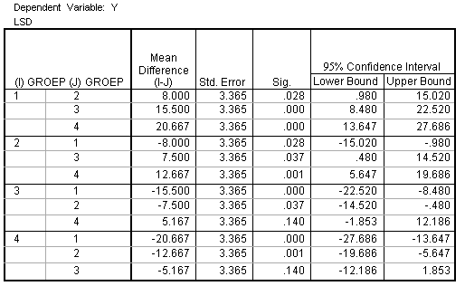

```{r, echo = FALSE, results = "hide"}
include_supplement("uva-oneway-anova-360-nl-graph01.png", recursive = TRUE)
```

Question
========

Een CRD-ANOVA die toetste of de populatiegemiddelden van 4 groepen
gelijk waren bleek significant te zijn. Hieronder staat SPSS-uitvoer van
de Fisher\'s LSD multiple comparisons post hoc tests die uitgevoerd zijn
om te bepalen welke groepen van elkaar verschillen. Welke groepen zijn
onderling significant verschillend op 5% niveau?



Answerlist
----------

2-4
1-2, 1-3, 1-4, 2-3 en 2-4
1-3, 1-4 en 2-4
allemaal

Solution
========

Answerlist
----------

2-4: Incorrect
1-2, 1-3, 1-4, 2-3 en 2-4: Incorrect
1-3, 1-4 en 2-4: Correct
allemaal: Incorrect

Meta-information
================
exname: uva-oneway-anova-360-nl
extype: schoice
exsolution: 0010
exsection: Inferential Statistics/Parametric Techniques/ANOVA/Oneway ANOVA
exextra[Type]: Interpreting output
exextra[Language]: Dutch
exextra[Level]: Statistical Literacy
exextra[IRT-Difficulty]: 2.932
exextra[p-value]: 0.4105
