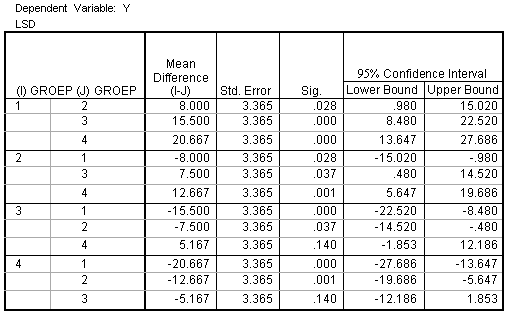

```{r, echo = FALSE, results = "hide"}
include_supplement("uva-oneway-anova-361-nl-graph01.png", recursive = TRUE)
```

Question
========

A CRD-ANOVA that tested whether the population averages of 4 groups were equal were found to be significant. Below is SPSS output of Fisher's LSD multiple comparisons post hoc tests that were performed to determine which groups differ from each other. To obtain Bonferroni corrected p-values, the LSD p-values must be



Answerlist
----------

* Be divided by 4
* Be divided by 6
* Multiply by 4
* Be multiplied by 6

Solution
========

Answerlist
----------

* Be divided by 4: Incorrect
* Be divided by 6: Incorrect
* Be multiplied by 4: Incorrect
* Be multiplied by 6: Correct

Meta-information
================
exname: uva-oneway-anova-361-en
extype: schoice
exsolution: 0001
exsection: Inferential Statistics/Parametric Techniques/ANOVA/Oneway ANOVA
exextra[Type]: Conceptual, Interpreting output
exextra[Language]: English
exextra[Level]: Statistical Literacy
exextra[IRT-Difficulty]: 3.758
exextra[p-value]: 0.1625
