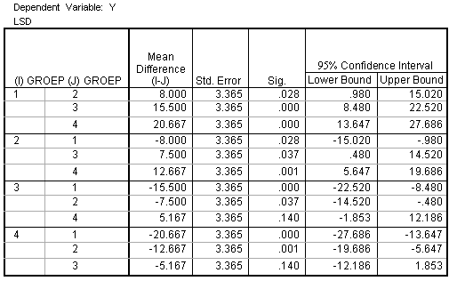

```{r, echo = FALSE, results = "hide"}
include_supplement("uva-oneway-anova-361-nl-graph01.png", recursive = TRUE)
```

Question
========

Een CRD-ANOVA die toetste of de populatiegemiddelden van 4 groepen
gelijk waren bleek significant te zijn. Hieronder staat SPSS-uitvoer van
de Fisher\'s LSD multiple comparisons post hoc tests die uitgevoerd zijn
om te bepalen welke groepen van elkaar verschillen. Om Bonferroni
gecorrigeerde p-waarden te verkrijgen moeten de LSD p-waarden



Answerlist
----------

gedeeld worden door 4
gedeeld worden door 6
vermenigvuldigd worden met 4
vermenigvuldigd worden met 6

Solution
========

Answerlist
----------

gedeeld worden door 4: Incorrect
gedeeld worden door 6: Incorrect
vermenigvuldigd worden met 4: Incorrect
vermenigvuldigd worden met 6: Correct

Meta-information
================
exname: uva-oneway-anova-361-nl
extype: schoice
exsolution: 0001
exsection: Inferential Statistics/Parametric Techniques/ANOVA/Oneway ANOVA
exextra[Type]: Conceptual, Interpreting output
exextra[Language]: Dutch
exextra[Level]: Statistical Literacy
exextra[IRT-Difficulty]: 3.758
exextra[p-value]: 0.1625
