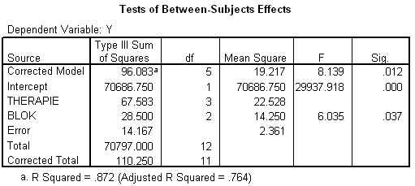

```{r, echo = FALSE, results = "hide"}
include_supplement("uva-oneway-anova-399-nl-graph01.png", recursive = TRUE)
```

Question
========

Hieronder staat (onvolledige) SPSS-uitvoer van een RCB-ANOVA, waarbij
binnen de blokken individuen aselect zijn toegewezen aan een therapie.
Het aantal vrijheidsgraden van de Error-term is gelijk aan



Answerlist
----------

4
5
6
7

Solution
========

Answerlist
----------

4: Incorrect
5: Incorrect
6: Correct
7: Incorrect

Meta-information
================
exname: uva-oneway-anova-399-nl
extype: schoice
exsolution: 0010
exsection: Inferential Statistics/Parametric Techniques/ANOVA/Oneway ANOVA
exextra[Type]: Conceptual, Interpreting output, Calculation
exextra[Language]: Dutch
exextra[Level]: Statistical Literacy
exextra[IRT-Difficulty]: 2.736
exextra[p-value]: 0.4342
