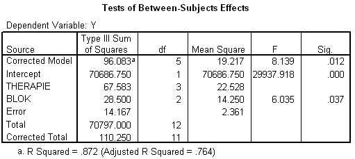

```{r, echo = FALSE, results = "hide"}
include_supplement("uva-oneway-anova-400-nl-graph01.png", recursive = TRUE)
```

Question
========

Below is (incomplete) SPSS output from a BAC ANOVA, in which within the blocks individuals were randomly assigned to a therapy. The conclusion regarding the block factor should read:



Answerlist
----------

* The block averages are significantly different.
* The block averages are significantly the same.
* The block averages are not significantly different.
* The hypothesis about block averages cannot be tested.

Solution
========

Answerlist
----------

* The block averages are significantly different:Incorrect
* The block averages are significantly the same...: Incorrect
* The block averages are not significantly different: Incorrect
* The hypothesis about block averages cannot be tested: Correct

Meta-information
================
exname: uva-oneway-anova-400-en
extype: schoice
exsolution: 0001
exsection: Inferential Statistics/Parametric Techniques/ANOVA/Oneway ANOVA
exextra[ID]: dc66e
exextra[Type]: Conceptual, Interpreting output
exextra[Language]: English
exextra[Level]: Statistical Literacy
exextra[IRT-Difficulty]: 3.73
exextra[p-value]: 0.1661
