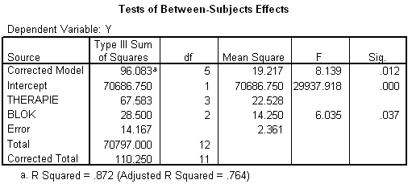

```{r, echo = FALSE, results = "hide"}
include_supplement("uva-oneway-anova-400-nl-graph01.png", recursive = TRUE)
```

Question
========

Hieronder staat (onvolledige) SPSS-uitvoer van een RCB-ANOVA, waarbij
binnen de blokken individuen aselect zijn toegewezen aan een therapie.
De conclusie omtrent de blokfactor moet luiden:



Answerlist
----------

* De blokgemiddelden zijn significant verschillend.
* De blokgemiddelden zijn significant gelijk.
* De blokgemiddelden zijn niet significant verschillend.
* De hypothese over blokgemiddelden kan niet getoetst worden.

Solution
========

Answerlist
----------

* De blokgemiddelden zijn significant verschillend.: Incorrect
* De blokgemiddelden zijn significant gelijk.: Incorrect
* De blokgemiddelden zijn niet significant verschillend.: Incorrect
* De hypothese over blokgemiddelden kan niet getoetst worden.: Correct

Meta-information
================
exname: uva-oneway-anova-400-nl
extype: schoice
exsolution: 0001
exsection: Inferential Statistics/Parametric Techniques/ANOVA/Oneway ANOVA
exextra[ID]: 9a181
exextra[Type]: Conceptual, Interpreting output
exextra[Language]: Dutch
exextra[Level]: Statistical Literacy
exextra[IRT-Difficulty]: 3.73
exextra[p-value]: 0.1661
