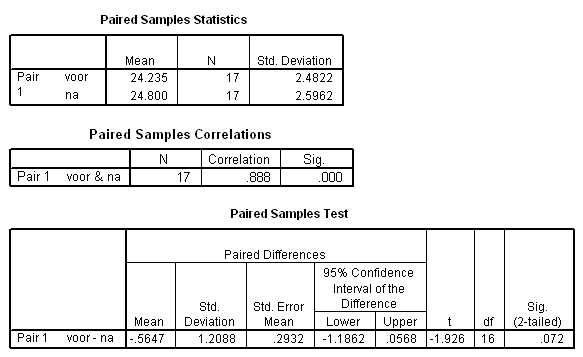

```{r, echo = FALSE, results = "hide"}
include_supplement("uva-paired-samples-270-nl-graph01.png", recursive = TRUE)
```

Question
========

In the paired T test, the null hypothesis H~0~: μ~D~ = μ~before~ - μ~after~ = 0 is tested. With a two-sided risk of α = 0.05, the conclusion is:



Answerlist
----------

* The T value found is in the critical range, reject H0.
* The T value found is not in the critical range, reject H0.
* The T value found is in the critical range, do not reject H0.
* The T value found is not in the critical range, do not reject H0.

Solution
========

Answerlist
----------

* The T value found is in the critical range, reject H0...: Incorrect
* The T value found is not in the critical range, reject H0: Incorrect
* The T-value found is in the critical range, reject H0 not...: Incorrect
* The T-value found is not in the critical range, do not reject H0...: Correct

Meta-information
================
exname: uva-paired-samples-270-en
extype: schoice
exsolution: 0001
exsection: Inferential Statistics/Parametric Techniques/t-test/Paired samples
exextra[ID]: 31a23
exextra[Type]: Conceptual
exextra[Language]: English
exextra[Level]: Statistical Literacy
exextra[IRT-Difficulty]: 3.952
exextra[p-value]: 0.1336
