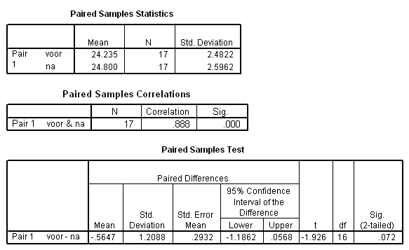

```{r, echo = FALSE, results = "hide"}
include_supplement("uva-paired-samples-270-nl-graph01.png", recursive = TRUE)
```

Question
========

In de gepaarde T-toets wordt de nulhypothese H~0~: μ~D~ = μ~voor~ -
μ~na~ = 0 getoetst. Bij een tweezijdig risico van α = 0.05 moet de
conclusie luiden:



Answerlist
----------

De gevonden T-waarde ligt in het kritiek gebied, verwerp H0.
De gevonden T-waarde ligt niet in het kritiek gebied, verwerp H0.
De gevonden T-waarde ligt in het kritiek gebied, verwerp H0 niet.
De gevonden T-waarde ligt niet in het kritiek gebied, verwerp H0 niet.

Solution
========

Answerlist
----------

De gevonden T-waarde ligt in het kritiek gebied, verwerp H0.: Incorrect
De gevonden T-waarde ligt niet in het kritiek gebied, verwerp H0.: Incorrect
De gevonden T-waarde ligt in het kritiek gebied, verwerp H0 niet.: Incorrect
De gevonden T-waarde ligt niet in het kritiek gebied, verwerp H0 niet.: Correct

Meta-information
================
exname: uva-paired-samples-270-nl
extype: schoice
exsolution: 0001
exsection: Inferential Statistics/Parametric Techniques/t-test/Paired samples
exextra[Type]: Conceptual
exextra[Language]: Dutch
exextra[Level]: Statistical Literacy
exextra[IRT-Difficulty]: 3.952
exextra[p-value]: 0.1336
