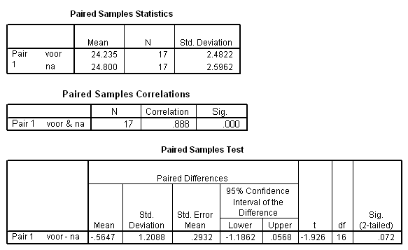

```{r, echo = FALSE, results = "hide"}
include_supplement("uva-paired-samples-271-nl-graph01.png", recursive = TRUE)
```

Question
========

In de gepaarde T-toets wordt de nulhypothese H~0~: μ~D~ = -1 getoetst.
Bij een tweezijdig risico van 5% moet de conclusie luiden:



Answerlist
----------

* Het resultaat is significant, verwerp H0.
* Het resultaat is niet significant, verwerp H0.
* Het resultaat is significant, verwerp H0 niet.
* Het resultaat is niet significant, verwerp H0 niet.

Solution
========

Het correcte antwoord is: 

* Het resultaat is niet significant, verwerp H0 niet.

Meta-information
================
exname: uva-paired-samples-271-nl
extype: schoice
exsolution: 0001
exsection: Inferential Statistics/Parametric Techniques/t-test/Paired samples
exextra[Type]: Conceptual
exextra[Language]: Dutch
exextra[Level]: Statistical Literacy
exextra[IRT-Difficulty]: 2.643
exextra[p-value]: 0.4456
