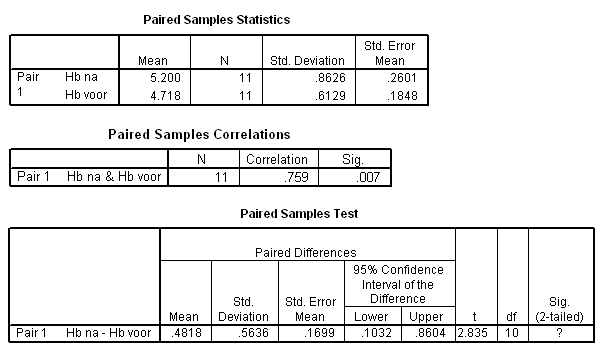

```{r, echo = FALSE, results = "hide"}
include_supplement("uva-paired-samples-289-nl-graph01.png", recursive = TRUE)
```

Question
========

Elf personen volgen een dieet om hun hemoglobine-gehalte te verhogen.
Hieronder staat SPSS-uitvoer van een toets om te kijken of het
Hb-gehalte voor en na het dieet inderdaad anders is. Bij het toetsen van
H~0~: μ~voor~ = μ~na~ tegen H~1~: μ~voor~ \< μ~na~, met een eenzijdig
risico van 5%, moet de conclusie luiden



Answerlist
----------

* Het toetsresultaat is significant, verwerp H0.
* Het toetsresultaat is significant, verwerp H0 niet.
* Het toetsresultaat is niet significant, verwerp H0.
* Het toetsresultaat is niet significant, verwerp H0 niet.

Solution
========

Answerlist
----------

* Het toetsresultaat is significant, verwerp H0.: Correct
* Het toetsresultaat is significant, verwerp H0 niet.: Incorrect
* Het toetsresultaat is niet significant, verwerp H0.: Incorrect
* Het toetsresultaat is niet significant, verwerp H0 niet.: Incorrect

Meta-information
================
exname: uva-paired-samples-289-nl
extype: schoice
exsolution: 1000
exsection: Inferential Statistics/Parametric Techniques/t-test/Paired samples
exextra[Type]: Interpreting output
exextra[Language]: Dutch
exextra[Level]: Statistical Literacy
exextra[IRT-Difficulty]: 2.416
exextra[p-value]: 0.4807
