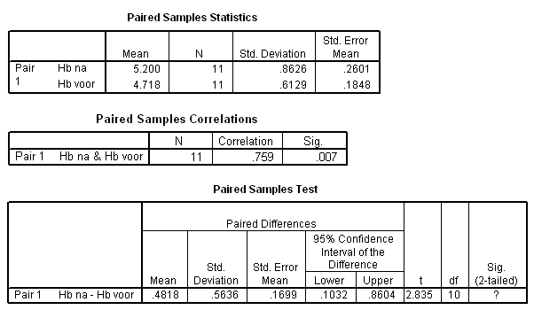

```{r, echo = FALSE, results = "hide"}
include_supplement("uva-paired-samples-290-nl-graph01.png", recursive = TRUE)
```

Question
========

Eleven individuals follow a diet to increase their hemoglobin levels. Below is SPSS output from a test to see if the Hb levels before and after the diet are indeed different. How much of the variation in the after measurements is related to the variation in the pre-measurements?



Answerlist
----------

* 75.9%
* 57.6%
* 56.4%
* 48.18%

Solution
========

Answerlist
----------

* 75.9%: Incorrect
* 57.6%: Correct
* 56.4%: Incorrect
* 48.18%: Incorrect

Meta-information
================
exname: uva-paired-samples-290-en
extype: schoice
exsolution: 0100
exsection: Inferential Statistics/Parametric Techniques/t-test/Paired samples
exextra[Type]: Interpreting output
exextra[Language]: English
exextra[Level]: Statistical Literacy
exextra[IRT-Difficulty]: 3.34
exextra[p-value]: 0.2341
