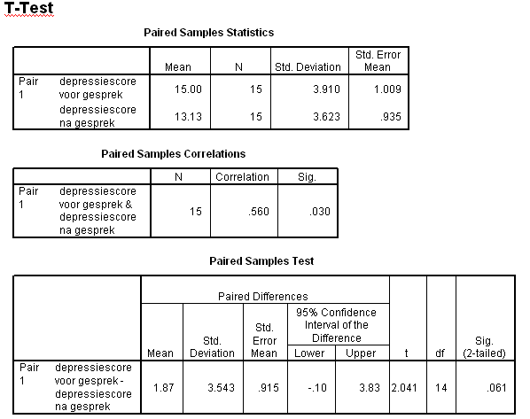

```{r, echo = FALSE, results = "hide"}
include_supplement("uva-paired-samples-332-nl-graph01.png", recursive = TRUE)
```

Question
========

Hieronder staat SPSS-uitvoer van een gepaarde T-toets op depressiescores
van 15 patiënten, gemeten voor en na een gesprek met een therapeut.
Hieronder staan twee uitspraken. Welke hiervan zijn juist?\
I: H~0~: μ~voor~ -- μ~na~ = 0 moet worden verworpen (bij α=5%
tweezijdig).\
II: var(X~gemiddeld\ voor~ - X~gemiddeld\ na~) =
var(X~gemiddeld\ voor~) + var(X~gemiddeld\ na~)



Answerlist
----------

* Beide uitspraken zijn juist.
* Uitspraak I is juist, uitspraak II is onjuist.
* Uitspraak I is onjuist, uitspraak II is juist.
* Beide uitspraken zijn onjuist.

Solution
========

Answerlist
----------

* Beide uitspraken zijn juist.: Incorrect
* Uitspraak I is juist, uitspraak II is onjuist.: Incorrect
* Uitspraak I is onjuist, uitspraak II is juist.: Incorrect
* Beide uitspraken zijn onjuist.: Correct

Meta-information
================
exname: uva-paired-samples-332-nl
extype: schoice
exsolution: 0001
exsection: Inferential Statistics/Parametric Techniques/t-test/Paired samples
exextra[Type]: Conceptual, Interpreting output
exextra[Language]: Dutch
exextra[Level]: Statistical Literacy
exextra[IRT-Difficulty]: 3.736
exextra[p-value]: 0.1645
