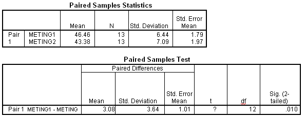

```{r, echo = FALSE, results = "hide"}
include_supplement("uva-paired-samples-354-nl-graph01.png", recursive = TRUE)
```

Question
========

Hieronder staat SPSS-uitvoer van een gepaarde T toets, met H~0~:
μ~meting\ 1~ = μ~meting\ 2~. De waarde van de toetsingsgrootheid t (het
vraagteken in de uitvoer) is gelijk aan



Answerlist
----------

* 1.1
* 1.16
* 1.21
* 3.05

Solution
========

Answerlist
----------

* 1.1: Incorrect
* 1.16: Incorrect
* 1.21: Incorrect
* 3.05: Correct

Meta-information
================
exname: uva-paired-samples-354-nl
extype: schoice
exsolution: 0001
exsection: Inferential Statistics/Parametric Techniques/t-test/Paired samples
exextra[Type]: Interpreting output, Calculation
exextra[Language]: Dutch
exextra[Level]: Statistical Literacy
exextra[IRT-Difficulty]: 3.358
exextra[p-value]: 0.2321
