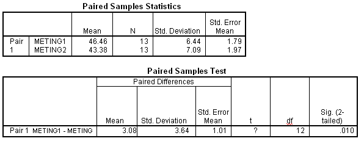

```{r, echo = FALSE, results = "hide"}
include_supplement("uva-paired-samples-355-nl-graph01.png", recursive = TRUE)
```

Question
========

Below is SPSS output from a paired T test, with H~0~: μ~measurement 1~ = μ~measurement 2~. The critical value from the table, at a two-sided risk of 0.05, is here equal to



Answerlist
----------

* 1.7823
* 2.0555
* 2.0639
* 2.1788

Solution
========

Answerlist
----------

* 1.7823: Incorrect
* 2.0555: Incorrect
* 2.0639: Incorrect
* 2.1788: Correct

Meta-information
================
exname: uva-paired-samples-355-en
extype: schoice
exsolution: 0001
exsection: Inferential Statistics/Parametric Techniques/t-test/Paired samples
exextra[ID]: 51af3
exextra[Type]: Interpreting output, Calculation
exextra[Language]: English
exextra[Level]: Statistical Literacy
exextra[IRT-Difficulty]: 3.697
exextra[p-value]: 0.1743
