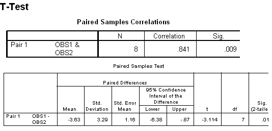

```{r, echo = FALSE, results = "hide"}
include_supplement("uva-paired-samples-486-nl-graph01.png", recursive = TRUE)
```

Question
========

Below is SPSS output from a paired T-test. The significance of the t-test is .017. Using the table, determine what here, under two-sided testing with α = 5% the limits of the critical area would be:



Answerlist
----------

* ± 1.960
* ± 2.3060
* ± 2.3646
* ± 2.4469

Solution
========

Answerlist
----------

± 1.960: Incorrect ± 2.3060: Incorrect ± 2.3646: Correct ± 2.4469: Incorrect

Meta-information
================
exname: uva-paired-samples-486-en
extype: schoice
exsolution: 0010
exsection: Inferential Statistics/Parametric Techniques/t-test/Paired samples
exextra[Type]: Interpreting output
exextra[Language]: English
exextra[Level]: Statistical Literacy
exextra[IRT-Difficulty]: 3.447
exextra[p-value]: 0.2243
