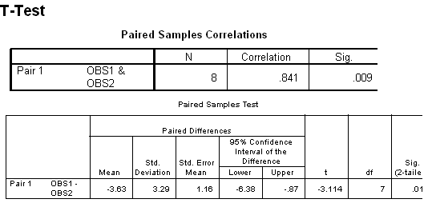

```{r, echo = FALSE, results = "hide"}
include_supplement("uva-paired-samples-486-nl-graph01.png", recursive = TRUE)
```

Question
========

Hieronder staat SPSS-uitvoer van een gepaarde T-toets. De significantie
van de t-toets is .017. Bepaal met behulp van de tabel wat hier bij
tweezijdig toetsen met α = 5% de grenzen van het kritiek gebied zouden
zijn:



Answerlist
----------

* ± 1.960
* ± 2.3060
* ± 2.3646
* ± 2.4469

Solution
========

Het correcte antwoord is: 

* ± 2.3646

Meta-information
================
exname: uva-paired-samples-486-nl
extype: schoice
exsolution: 0010
exsection: Inferential Statistics/Parametric Techniques/t-test/Paired samples
exextra[Type]: Interpreting output
exextra[Language]: Dutch
exextra[Level]: Statistical Literacy
exextra[IRT-Difficulty]: 3.447
exextra[p-value]: 0.2243
