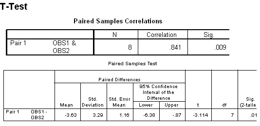

```{r, echo = FALSE, results = "hide"}
include_supplement("uva-paired-samples-487-nl-graph01.png", recursive = TRUE)
```

Question
========

Below is SPSS output from a paired T-test. The significance of the t-test is .017. When testing the null hypothesis that population averages of OBS1 and OBS2 are equal, with α = **0.01** two-sided, the conclusion should be:



Answerlist
----------

* A significant result, H0 is rejected
* One significant result, H0 is not rejected
* No significant result, H0 is rejected
* No significant result, H0 is not rejected

Solution
========

Answerlist
----------

* A significant result, H0 is rejected: Incorrect
* A significant result, H0 is not rejected: Incorrect
* No significant result, H0 is rejected: Incorrect
* No significant result, H0 is not rejected: Correct

Meta-information
================
exname: uva-paired-samples-487-en
extype: schoice
exsolution: 0001
exsection: Inferential Statistics/Parametric Techniques/t-test/Paired samples
exextra[Type]: Interpreting output
exextra[Language]: English
exextra[Level]: Statistical Literacy
exextra[IRT-Difficulty]: 3.639
exextra[p-value]: 0.179
