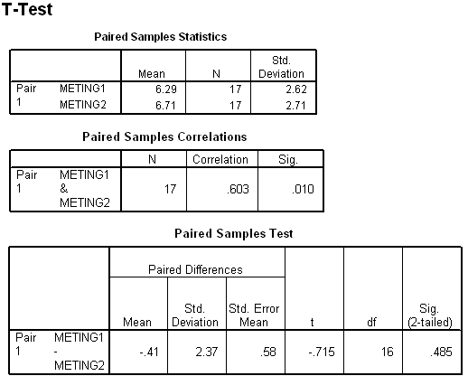

```{r, echo = FALSE, results = "hide"}
include_supplement("uva-paired-samples-504-nl-graph01.png", recursive = TRUE)
```

Question
========

Below is a portion of the SPSS output from a paired T-test on two measurements on 17 people. The estimated standard error of the sample mean of METING1 is equal to



Answerlist
----------

* 0.15
* 0.58
* 0.64
* 2.62

Solution
========

Answerlist
----------

* 0.15: Incorrect
* 0.58: Incorrect
* 0.64: Correct
* 2.62: Incorrect

Meta-information
================
exname: uva-paired-samples-504-en
extype: schoice
exsolution: 0010
exsection: Inferential Statistics/Parametric Techniques/t-test/Paired samples
exextra[Type]: Interpreting output, Calculation
exextra[Language]: English
exextra[Level]: Statistical Literacy
exextra[IRT-Difficulty]: 2.888
exextra[p-value]: 0.4152
