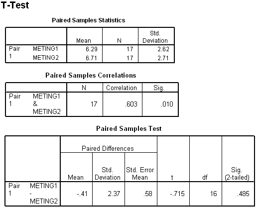

```{r, echo = FALSE, results = "hide"}
include_supplement("uva-paired-samples-505-nl-graph01.png", recursive = TRUE)
```

Question
========

Below is a portion of the SPSS output from a paired T-test on two measurements on 17 people. The critical area for the test size for testing *equity* of population averages is



Answerlist
----------

* <-∞; -1.7459] ∪ [1.7459; ∞>
* <- ∞; -2.1199] ∪ [2.1199; ∞>
* <-2.1199; 2.1199>
* <-2.1098; 2.1098>

Solution
========

Answerlist
----------

* <-∞; -1.7459] ∪ [1.7459; ∞>: Incorrect
* <- ∞; -2.1199] ∪ [2.1199; ∞>: Correct
* <-2.1199; 2.1199>: Incorrect
* <-2.1098; 2.1098>: Incorrect

Meta-information
================
exname: uva-paired-samples-505-en
extype: schoice
exsolution: 0100
exsection: Inferential Statistics/Parametric Techniques/t-test/Paired samples
exextra[Type]: Interpreting output
exextra[Language]: English
exextra[Level]: Statistical Literacy
exextra[IRT-Difficulty]: 3.008
exextra[p-value]: 0.2976
