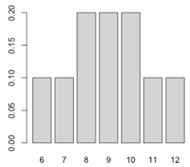

```{r, echo = FALSE, results = "hide"}
include_supplement("uva-rank-sum-test-77-nl-graph01.png", recursive = TRUE)
```

Question
========

A researcher has few subjects to compare two populations comparison. Therefore, she uses the *Wilcoxon rank sum* test for data with three subjects in one group and two subjects in the other. The null hypothesis states that the rank sum is the same for the two populations, and as an alternative hypothesis it has that one population scores lower than the other. A figure shows the exact probability distribution is shown: TRUE is the lowest P-value for the above hypotheses that can be obtained with this probability distribution?



Answerlist
----------

* 0.05
* 0.10
* 0.20

Solution
========

Answerlist
----------

* 0.05: Incorrect
* 0.10: Correct
* 0.20: Incorrect

Meta-information
================
exname: uva-rank-sum-test-77-en
extype: schoice
exsolution: 010
exsection: Inferential Statistics/Non-parametric Techniques/Rank Sum test
exextra[Type]: Conceptual, Calculation
exextra[Language]: English
exextra[Level]: Statistical Literacy
exextra[IRT-Difficulty]: 2.418
exextra[p-value]: 0.4801
