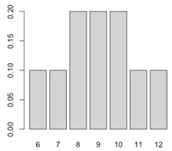

```{r, echo = FALSE, results = "hide"}
include_supplement("uva-rank-sum-test-77-nl-graph01.png", recursive = TRUE)
```

Question
========

Een onderzoeker heeft weinig proefpersonen om twee populaties te
vergelijken. Daarom gebruikt zij de *Wilcoxon rank sum* test voor data
met in de ene groep drie en in de andere groep twee proefpersonen. De
nulhypothese stelt dat de som van de rangordeningen hetzelfde is voor de
twee populaties, en als alternatieve hypothese heeft zij dat de ene
populatie lager scoort dan de andere. In een figuur is de exacte
kansverdeling weergegeven: Wat is de laagste P-waarde voor de
bovenstaande hypotheses die met deze kansverdeling behaald kan worden?



Answerlist
----------

* 0.05
* 0.10
* 0.20

Solution
========

Answerlist
----------

* 0.05: Incorrect
* 0.10: Correct
* 0.20: Incorrect

Meta-information
================
exname: uva-rank-sum-test-77-nl
extype: schoice
exsolution: 010
exsection: Inferential Statistics/Non-parametric Techniques/Rank Sum test
exextra[ID]: 9b281
exextra[Type]: Conceptual, Calculation
exextra[Language]: Dutch
exextra[Level]: Statistical Literacy
exextra[IRT-Difficulty]: 2.418
exextra[p-value]: 0.4801
