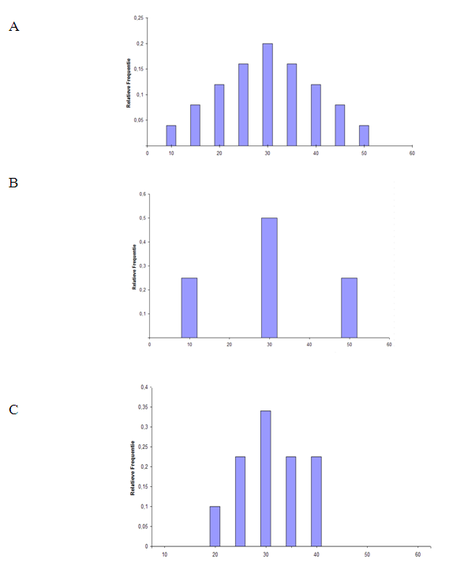

```{r, echo = FALSE, results = "hide"}
include_supplement("uva-sample-mean-1286-nl-graph01.png", recursive = TRUE)
```

Question
========

There are three small populations of students in different STEM subjects, each with an average of 30. Below are the values in each population:_____. I 10, 50\ II 10, 20, 30, 40, 50. III 20, 30, 40. \ Which graph below belongs to II?



Answerlist
----------

* A
* B
* C

Solution
========

Answerlist
----------

* A: Correct
* B: Incorrect
* C: Incorrect

Meta-information
================
exname: uva-sample-mean-1286-en
extype: schoice
exsolution: 100
exsection: Inferential Statistics/Sampling Distributions/Sample mean
exextra[ID]: 8d1dd
exextra[Type]: Conceptual
exextra[Language]: English
exextra[Level]: Statistical Literacy
exextra[IRT-Difficulty]: 2
exextra[p-value]: 0.5905
