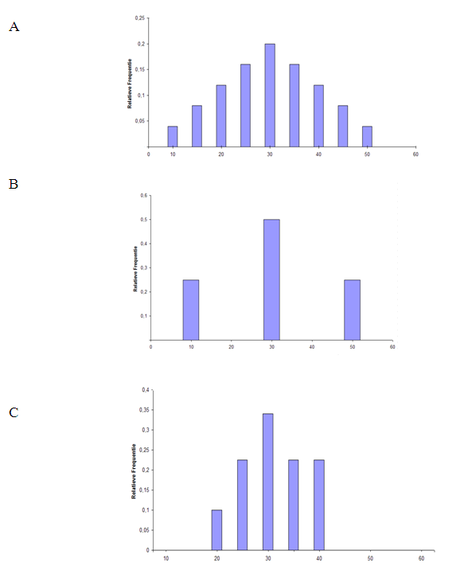

```{r, echo = FALSE, results = "hide"}
include_supplement("uva-sample-mean-1288-nl-graph01.png", recursive = TRUE)
```

Question
========

Er zijn drie kleine populaties van studenten in verschillende
bètavakken, elk met een gemiddelde van 30. Hieronder zie je de waarden
in elke populatie:\
                  I          10, 50\
                  II         10, 20, 30, 40, 50\
                  III       20, 30, 40.\
\
Welke populatie heeft de kleinste standaardfout?



Answerlist
----------

* A
* B
* C

Solution
========

Het correcte antwoord is: 

* C

Meta-information
================
exname: uva-sample-mean-1288-nl
extype: schoice
exsolution: 001
exsection: Inferential Statistics/Sampling Distributions/Sample mean
exextra[Type]: Conceptual
exextra[Language]: Dutch
exextra[Level]: Statistical Literacy
exextra[IRT-Difficulty]: 2
exextra[p-value]: 0.5905
