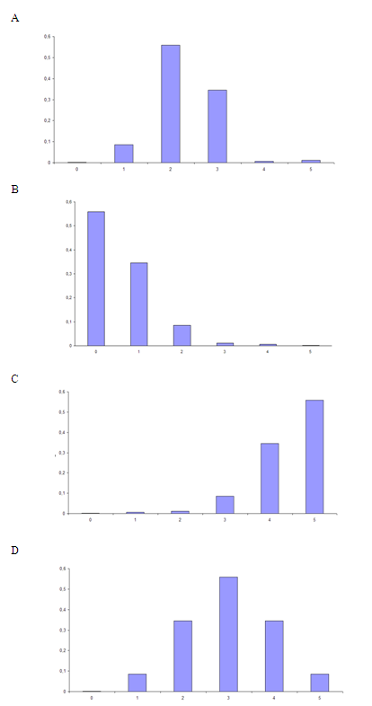

```{r, echo = FALSE, results = "hide"}
include_supplement("uva-sample-mean-1300-nl-graph01.png", recursive = TRUE)
```

Question
========

About 11% of Dutch people aged 17 to 23 are early school leaver. If you randomly choose five people from this age group, which graph below is the correct sample distribution of the number of early school leavers?



Answerlist
----------

* A
* B
* C
* D

Solution
========

Answerlist
----------

* A: Incorrect
* B: Correct
* C: Incorrect
* D: Incorrect

Meta-information
================
exname: uva-sample-mean-1300-en
extype: schoice
exsolution: 0100
exsection: Inferential Statistics/Sampling Distributions/Sample mean
exextra[ID]: a1f9a
exextra[Type]: Conceptual
exextra[Language]: English
exextra[Level]: Statistical Literacy
exextra[IRT-Difficulty]: 2
exextra[p-value]: 0.5905
