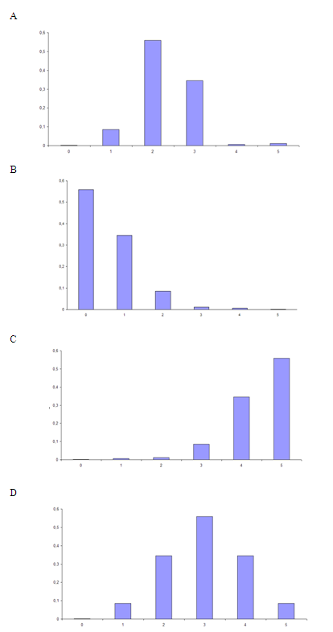

```{r, echo = FALSE, results = "hide"}
include_supplement("uva-sample-mean-1300-nl-graph01.png", recursive = TRUE)
```

Question
========

Ongeveer 11% van Nederlanders in de leeftijd van 17 tot 23 jaar is
voortijdig schoolverlater. Als je aselect vijf mensen kiest uit deze
leeftijdsgroep, welke grafiek hieronder is dan de juiste
steekproefverdeling van het aantal vroegtijdige schoolverlaters?



Answerlist
----------

* A
* B
* C
* D

Solution
========

Het correcte antwoord is: 

* B

Meta-information
================
exname: uva-sample-mean-1300-nl
extype: schoice
exsolution: 0100
exsection: Inferential Statistics/Sampling Distributions/Sample mean
exextra[Type]: Conceptual
exextra[Language]: Dutch
exextra[Level]: Statistical Literacy
exextra[IRT-Difficulty]: 2
exextra[p-value]: 0.5905
