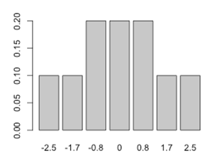

```{r, echo = FALSE, results = "hide"}
include_supplement("uva-signed-rank-test-803-nl-graph01.png", recursive = TRUE)
```

Question
========

In a study with only 5 subjects, the Wilcoxon test is is used to compare two groups. In group 1, 3 subjects are randomly placed and in group 2, 2 subjects are randomly placed. The difference in mean rank is used to compare the two groups comparison. The null hypothesis states that the mean rank order is the same for both groups. The alternative hypothesis states that group 1 has a higher mean rank than group 2. For the comparison used: group 1 -- group 2 (group 1 minus group 2). The difference in the sample found is 1.7. Given the exact probability distribution that is shown below, what is now the P-value?



Answerlist
----------

* 0.1
* 0.2
* 0,4

Solution
========

Answerlist
----------

* 0.1: Incorrect
* 0.2: Correct
* 0,4: Incorrect

Meta-information
================
exname: uva-signed-rank-test-803-en
extype: schoice
exsolution: 010
exsection: Inferential Statistics/Non-parametric Techniques/Signed Rank test
exextra[Type]: Conceptual
exextra[Language]: English
exextra[Level]: Statistical Literacy
exextra[IRT-Difficulty]: 3.041
exextra[p-value]: 0.2914
