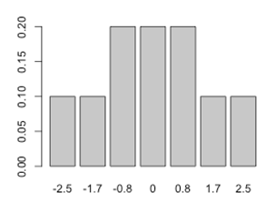

```{r, echo = FALSE, results = "hide"}
include_supplement("uva-signed-rank-test-803-nl-graph01.png", recursive = TRUE)
```

Question
========

In een onderzoek met maar 5 proefpersonen wordt de Wilcoxon test
gebruikt om twee groepen te vergelijken. In groep 1 zijn 3 proefpersonen
aselect geplaatst en in groep 2 zijn 2 proefpersonen aselect geplaatst.
Het verschil in gemiddelde rang wordt gebruikt om de twee groepen te
vergelijken. De nulhypothese stelt dat de gemiddelde rangordening gelijk
is voor beide groepen. De alternatieve hypothese stelt dat groep 1 een
hogere gemiddelde rangorde heeft dan groep 2. Voor de vergelijking wordt
gebruikt: groep 1 -- groep 2 (groep 1 minus groep 2). Het verschil in de
steekproef dat is gevonden is 1.7. Gegeven de exacte kansverdeling die
hieronder staat afgebeeld, wat is nu de P-waarde?



Answerlist
----------

* 0.1
* 0.2
* 0,4

Solution
========

Answerlist
----------

* 0.1: Incorrect
* 0.2: Correct
* 0,4: Incorrect

Meta-information
================
exname: uva-signed-rank-test-803-nl
extype: schoice
exsolution: 010
exsection: Inferential Statistics/Non-parametric Techniques/Signed Rank test
exextra[ID]: dd30b
exextra[Type]: Conceptual
exextra[Language]: Dutch
exextra[Level]: Statistical Literacy
exextra[IRT-Difficulty]: 3.041
exextra[p-value]: 0.2914
