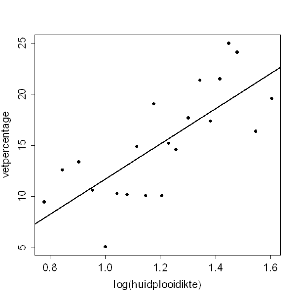

```{r, echo = FALSE, results = "hide"}
include_supplement("uva-simple-linear-regression-1386-nl-graph01.png", recursive = TRUE)
```

Question
========

Fat percentage can be estimated using (the logarithm of) the sum of the skinfold thicknesses of biceps and triceps.______________________ Attached is a scatterplot plotting both of these variables against each other.Ê The estimated fat percentage at a log(skinfold thickness) of 0.8 is:



Answerlist
----------

* 7.5
* 8.3
* 9.5
* 9.8

Solution
========

Answerlist
----------

* 7.5: Incorrect
* 8.3: Correct
* 9.5: Incorrect
* 9.8: Incorrect

Meta-information
================
exname: uva-simple-linear-regression-1386-en
extype: schoice
exsolution: 0100
exsection: Inferential Statistics/Regression/Simple linear regression
exextra[ID]: d2a16
exextra[Type]: Calculation
exextra[Language]: English
exextra[Level]: Statistical Literacy
exextra[IRT-Difficulty]: 0
exextra[p-value]: 0.9242
