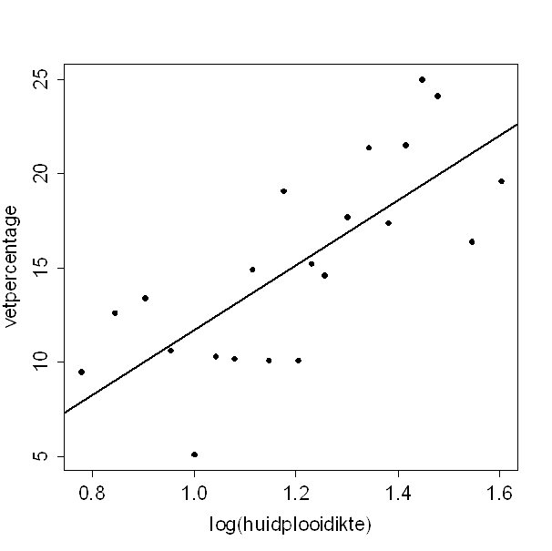

```{r, echo = FALSE, results = "hide"}
include_supplement("uva-simple-linear-regression-1386-nl-graph01.png", recursive = TRUE)
```

Question
========

Vetpercentage kan geschat worden met behulp van (de logaritme van) de
som van de huidplooidiktes van biceps en triceps.\
Bijgaand is een spreidingsdiagram waarin deze beide variabelen tegen
elkaar staan uitgezet.\
Het geschatte vetpercentage bij een log(huidplooidikte) van 0.8 is:



Answerlist
----------

* 7.5
* 8.3
* 9.5
* 9.8

Solution
========

Answerlist
----------

* 7.5: Incorrect
* 8.3: Correct
* 9.5: Incorrect
* 9.8: Incorrect

Meta-information
================
exname: uva-simple-linear-regression-1386-nl
extype: schoice
exsolution: 0100
exsection: Inferential Statistics/Regression/Simple linear regression
exextra[ID]: 03b42
exextra[Type]: Calculation
exextra[Language]: Dutch
exextra[Level]: Statistical Literacy
exextra[IRT-Difficulty]: 0
exextra[p-value]: 0.9242
