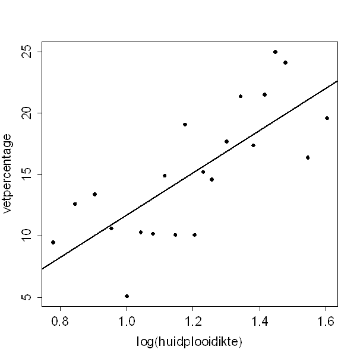

```{r, echo = FALSE, results = "hide"}
include_supplement("uva-simple-linear-regression-1387-nl-graph01.png", recursive = TRUE)
```

Question
========

Fat percentage can be estimated using (the logarithm of) the sum of the skinfold thicknesses of biceps and triceps.______________________ Attached is a scatterplot plotting both of these variables against each other. The person with the highest measured fat percentage in the sample, has A log(skinfold thickness) of:



Answerlist
----------

* 0.78
* 1.45
* 1.60
* 25.0

Solution
========

Answerlist
----------

* 0.78: Incorrect
* 1.45: Correct
* 1.60: Incorrect
* 25.0: Incorrect

Meta-information
================
exname: uva-simple-linear-regression-1387-en
extype: schoice
exsolution: 0100
exsection: Inferential Statistics/Regression/Simple linear regression
exextra[Type]: Calculation
exextra[Language]: English
exextra[Level]: Statistical Literacy
exextra[IRT-Difficulty]: 0
exextra[p-value]: 0.9242
