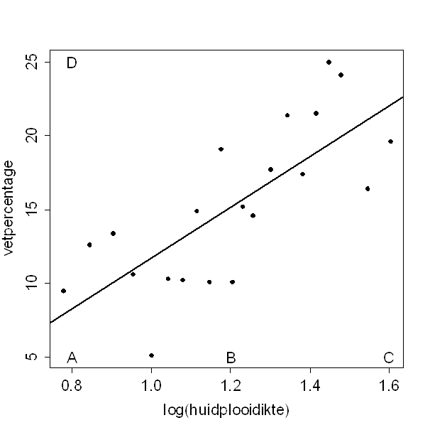

```{r, echo = FALSE, results = "hide"}
include_supplement("uva-simple-linear-regression-1389-nl-graph01.png", recursive = TRUE)
```

Question
========

Vetpercentage kan geschat worden met behulp van (de logaritme van) de
som van de huidplooidiktes van biceps en triceps.\
Bijgaand is een spreidingsdiagram waarin deze beide variabelen tegen
elkaar staan uitgezet.\
Stel dat er een persoon extra gemeten wordt, A, B, C of D. Door welke
persoon zou de richtingscoëfficiënt van de regressielijn het meest
toenemen? 



Answerlist
----------

* A
* B
* C
* D

Solution
========

Answerlist
----------

* A: Correct
* B: Incorrect
* C: Incorrect
* D: Incorrect

Meta-information
================
exname: uva-simple-linear-regression-1389-nl
extype: schoice
exsolution: 1000
exsection: Inferential Statistics/Regression/Simple linear regression
exextra[ID]: a7793
exextra[Type]: Conceptual
exextra[Language]: Dutch
exextra[Level]: Statistical Literacy
exextra[IRT-Difficulty]: 0.227
exextra[p-value]: 0.9185
