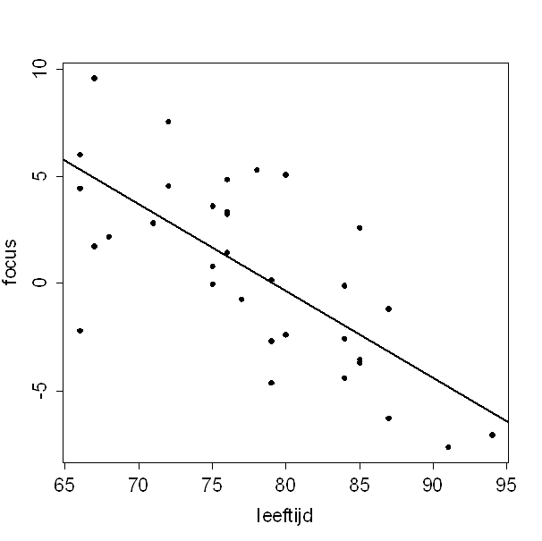

```{r, echo = FALSE, results = "hide"}
include_supplement("uva-simple-linear-regression-1394-nl-graph01.png", recursive = TRUE)
```

Question
========

One study examined the relationship between age and the ability to focus on something. Below is a scatterplot of the results, along with the corresponding regression line.______________________________. Based on extrapolation using the given regression line, it would be The estimated ability to focus of a 100-year-old would be equal To:



Answerlist
----------

* -11.4
* -8.5
* -6.0
* -4.4

Solution
========

Answerlist
----------

* 11.4: Incorrect
* 8.5: Correct
* 6.0: Incorrect
* 4.4: Incorrect

Meta-information
================
exname: uva-simple-linear-regression-1394-en
extype: schoice
exsolution: 0100
exsection: Inferential Statistics/Regression/Simple linear regression
exextra[Type]: Calculation
exextra[Language]: English
exextra[Level]: Statistical Literacy
exextra[IRT-Difficulty]: 0
exextra[p-value]: 0.9242
