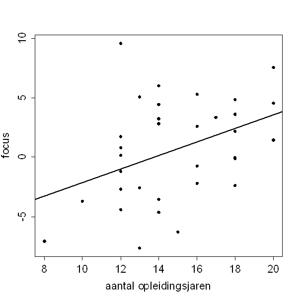

```{r, echo = FALSE, results = "hide"}
include_supplement("uva-simple-linear-regression-1398-nl-graph01.png", recursive = TRUE)
```

Question
========

In een onderzoek is bij 33 ouderen gekeken naar het verband tussen
opleidingsniveau (aantal jaren school) en het vermogen om ergens op te
focussen. Hieronder staat een spreidingsdiagram van de resultaten, met
de bijbehorende regressielijn.\
Op grond van extrapolatie met behulp van de gegeven regressielijn zou
het geschatte vermogen om te focussen van een iemand met 5 jaren
opleiding gelijk zijn aan:



Answerlist
----------

-7.8
-6.4
-5.0
-3.4

Solution
========

Answerlist
----------

-7.8: Incorrect
-6.4: Incorrect
-5.0: Correct
-3.4: Incorrect

Meta-information
================
exname: uva-simple-linear-regression-1398-nl
extype: schoice
exsolution: 0010
exsection: Inferential Statistics/Regression/Simple linear regression
exextra[Type]: Calculation
exextra[Language]: Dutch
exextra[Level]: Statistical Literacy
exextra[IRT-Difficulty]: 0
exextra[p-value]: 0.9242
