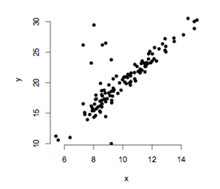

```{r, echo = FALSE, results = "hide"}
include_supplement("uva-simple-linear-regression-41-nl-graph01.png", recursive = TRUE)
```

Question
========

To establish a relationship between the continuous variables *x* and *y*, a regression analysis is performed. Before interpreting the results interpretation, a number of assumptions for testing the regression coefficients are checked. As a first indication, the values of *x* and *y* are plotted on a graph. The graph shows that the assumption of regression is violated which states



Answerlist
----------

* That the population mean of y is linearly related to x.
* That the population standard deviation of y is the same for all values of x.
* That the population distribution of y is normally distributed for all values of x.

Solution
========

Answerlist
----------

* That the population mean of y is linearly related to x.: Incorrect
* That the population standard deviation of y is the same for all values of x.: Correct
* That the population distribution of y for all values of x is normally distributed...: Incorrect

Meta-information
================
exname: uva-simple-linear-regression-41-en
extype: schoice
exsolution: 010
exsection: Inferential Statistics/Regression/Simple linear regression
exextra[ID]: 374a4
exextra[Type]: Conceptual
exextra[Language]: English
exextra[Level]: Statistical Literacy
exextra[IRT-Difficulty]: 5.255
exextra[p-value]: 0.0072
