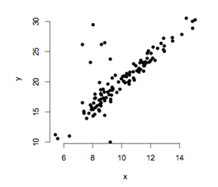

```{r, echo = FALSE, results = "hide"}
include_supplement("uva-simple-linear-regression-41-nl-graph01.png", recursive = TRUE)
```

Question
========

Voor het vaststellen van een relatie tussen de continue variabelen *x*
en *y* wordt een regressie-analyse uitgevoerd. Alvorens de resultaten te
interpreteren, wordt een aantal assumpties voor het toetsen op de
regressiecoëfficiënten gecontroleerd. Als eerste indicatie worden de
waarden van *x* en *y* in een grafiek uitgezet. Uit de grafiek blijkt
dat de assumptie van regressie geschonden is die stelt



Answerlist
----------

dat het populatiegemiddelde van y lineair gerelateerd is aan x.
dat de populatiestandaarddeviatie van y hetzelfde is voor alle waarden van x.
dat de populatieverdeling van y voor alle waarden van x normaal verdeeld is.

Solution
========

Answerlist
----------

dat het populatiegemiddelde van y lineair gerelateerd is aan x.: Incorrect
dat de populatiestandaarddeviatie van y hetzelfde is voor alle waarden van x.: Correct
dat de populatieverdeling van y voor alle waarden van x normaal verdeeld is.: Incorrect

Meta-information
================
exname: uva-simple-linear-regression-41-nl
extype: schoice
exsolution: 010
exsection: Inferential Statistics/Regression/Simple linear regression
exextra[Type]: Conceptual
exextra[Language]: Dutch
exextra[Level]: Statistical Literacy
exextra[IRT-Difficulty]: 5.255
exextra[p-value]: 0.0072
