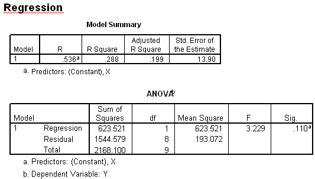

```{r, echo = FALSE, results = "hide"}
include_supplement("uva-simple-linear-regression-410-nl-graph01.png", recursive = TRUE)
```

Question
========

Below is SPSS output from a regression analysis of Y on X. What percentage of the variation in Y can be explained by X, in this sample?



Answerlist
----------

* 13.9%
* 19.9%
* 28.8%
* 53.6%

Solution
========

Answerlist
----------

* 13.9%: Incorrect
* 19.9%: Incorrect
* 28.8%: Correct
* 53.6%: Incorrect

Meta-information
================
exname: uva-simple-linear-regression-410-en
extype: schoice
exsolution: 0010
exsection: Inferential Statistics/Regression/Simple linear regression
exextra[ID]: 5cc1b
exextra[Type]: Conceptual, Interpreting output
exextra[Language]: English
exextra[Level]: Statistical Literacy
exextra[IRT-Difficulty]: 2.08
exextra[p-value]: 0.5425
